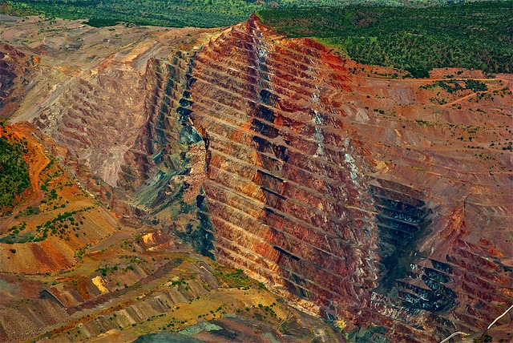

# Images

Choose an address. You can use your own address to test. When ready, press the button and the frame will be applied to all images bellow.

Each image has a different rate. Try donating 10 cents. If Bitcoin Cash is worth $500 then the top left image will show for about 1 minute and the bottom right for about 7 seconds.



<table>
<tr>
  <td>
    </img>
  </td>
  <td>
    </img>
  </td>
</tr>
<tr>
  <td>
    </img>
  </td>
  <td>
    </img>
  </td>
</tr>
</table>

